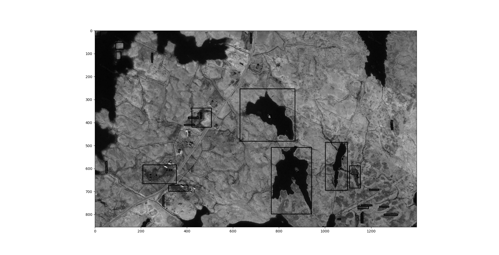

# geo-mapping-finance
A combination of GIS, Machine Learning/Artificial Intelligence and Finance

## Output

## Links
* [Detecting peatland drains with Object Based Image Analysis and Geoeye-1 imagery](https://cbmjournal.biomedcentral.com/articles/10.1186/s13021-017-0075-z)
* [How peat could protect the planet](https://www.nature.com/articles/d41586-020-00355-3)
* [What's so special about peatlands](https://www.iucn-uk-peatlandprogramme.org/about-peatlands)
